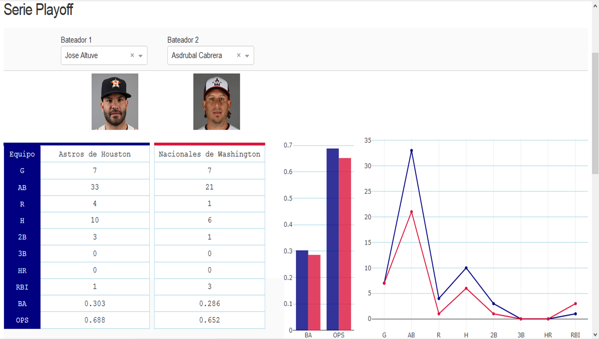

# World-Series-2019-MLB

Dashboard with information of the teams of the championship series of Major League Baseball's (MLB) 2019 season. 
This series was a best-of-seven playoff between the American League champion Houston Astros and the National League champion Washington Nationals. 


## About this app

Dashboard with information of the 2019 Wolrd Series of Major League Baseball's (MLB). This app is presented in the Spanish language, however the statistics visualized are universal for this sport.

Source: Baseball Reference, https://www.baseball-reference.com/postseason/2019_WS.shtml , Copyright © 2000-2020 Sports Reference LLC.  

Logos: Chris Creamer's Sports Logos Page, https://www.sportslogos.net , Copyright ©1997-2020 Chris Creamer.

Images: FantasyPros.com © Copyright 2010-2020, https://www.fantasypros.com/mlb/compare/

All logos and images are the trademark & property of their owners. We present them here for purely educational purposes.


## Screenshots




## Getting Started

### Running the app locally

Create a virtual environment with conda or venv inside a temp folder, then activate it.

```
virtualenv venv

# Windows
venv\Scripts\activate
# Or Linux
source venv/bin/activate
```

Clone the git repo, then install the requirements with pip.

```
git clone https://github.com/bellorinp/World-Series-2019-MLB
cd World-Series-2019-MLB 
pip install -r requirements.txt
```

Run the app.

```
python app.py
```

Open http://127.0.0.1:8050/ in your browser.


### View the app in Heroku

This app running in [Heroku.](https://world-series-2019-mlb.herokuapp.com/)

Deploy to your own free Heroku server, using guide to deployment from [Heroku with Python.](https://devcenter.heroku.com/articles/getting-started-with-python)

## Built With

[Dash](https://plotly.com/dash/) - Main server and interactive components.

[Plotly Python](https://plotly.com/) - Used to create the interactive plots.

[pandas](https://pandas.pydata.org/) - Used to data analysis and manipulation.
